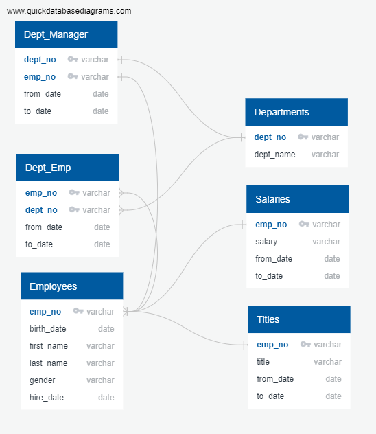

# Pewlett-Hackard-Analysis

## Purpose
In this lesson we were learning the basics of SQL and merging tables. We were given data sets from "Pewlett Hackard" to analyse to determine how many employees were retirement age and determine the viability of starting a mentorship program to train younger employees to replace those who would be aging out.

## Method
We began with six seperate CSV sets, joined by different identifier keys. The ERD for this data can be seen below. 

The first deliverable was to determine the total number of employees who were expected to retire soon. We did this by filtering employees by birth date, selecting only those who were born between 1952 and 1955. That data is saved in unique_titles.csv. From this data, a summary was created of how many retirement eligible employees held certain positions. This can be found in retiring_titles.csv.

The second deliverable was to determine which employees were eligible for the mentorship program. We did this by filtering by birth date, selecting only those who were born in 1965. This data is saved in mentorship_eligibilty.csv.

## Results: 
1. There is a large number of employees aging out of Pewlett Hackard's work force.
2. The vast majority of these employees are engineers or senior engineers and senior staff.
3. The potential loss of collective knowledge of the firm's leadership is a point that should be of serious concern.
4. There are not enough employees in the current pool of available mentees to fill this gap.

## Summary: 
Based on the data collected, there will be over 90,000 employees retiring as part of the "silver tsunami" in the coming years. (SELECT COUNT (*) FROM unique_titles; -- output: 90398)
There are plenty of retirement-ready employees in the departments to mentor the next generation of Pewlett Hackard employees, but there are not enough mentorship qualified employees to take over and fill the gap. (SELECT COUNT (*) FROM mentorship_eligibilty;  --output: 1549)
An additional problem is that the titles of the mentees do not align with those of the mentors. A decent portion of those eligible for mentorship do not have senior titles. (see mentorship_titles)
Pewlett Hackard will have an employee shortage if it continues on its current path. I would recommend that they focus on expanding and training their lower level work force and begin moving current eligible employees up in management to prepare for the transition as employees begin to retire. 
